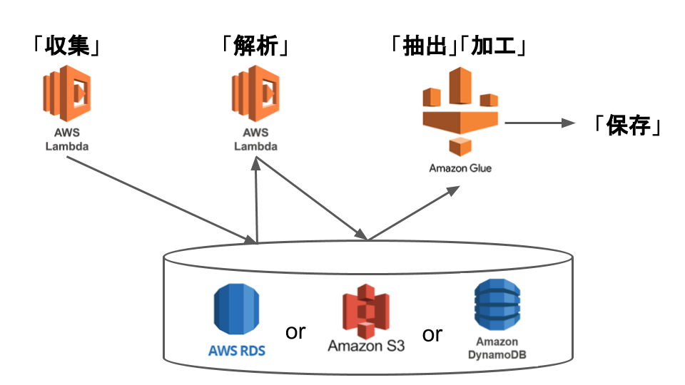

# アーキテクチャ

 - [AWS Lambda（イベント発生時にコードを実行）| AWS](https://aws.amazon.com/jp/lambda/)
 - [AWS Glue（分析用データ抽出、変換、ロード (ETL) ）| AWS](https://aws.amazon.com/jp/glue/?whats-new-cards.sort-by=item.additionalFields.postDateTime&whats-new-cards.sort-order=desc)

データストレージ

 - [Amazon RDS for MySQL （MySQLのためのマネージドリレーショナルデータベース） | AWS](https://aws.amazon.com/jp/rds/mysql/)
 - [Amazon S3（拡張性と耐久性を兼ね揃えたクラウドストレージ）｜AWS](https://aws.amazon.com/jp/s3/)
 - [Amazon DynamoDB（マネージド NoSQL データベース）| AWS](https://aws.amazon.com/jp/dynamodb/)

